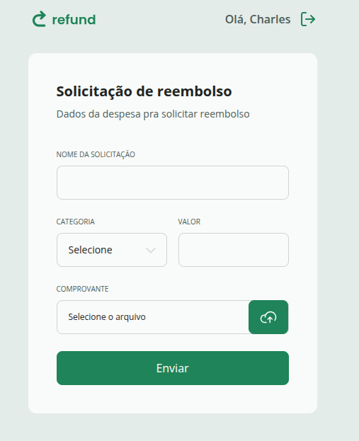
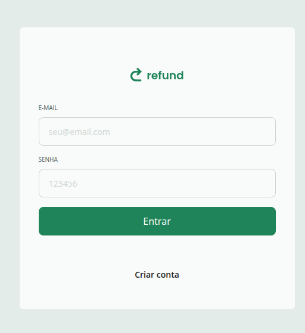
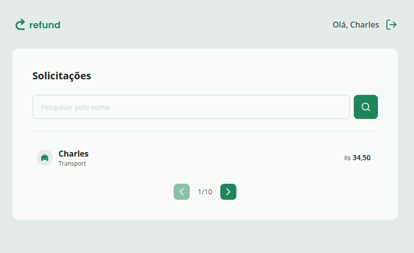

# reembolso


# Refund - Sistema de Solicitação de Reembolso

Este é um projeto web desenvolvido em React para gerenciar solicitações de reembolso, com diferentes fluxos para funcionários e gestores.

## Preview

O preview estará disponível em:

- 
- 
- 

## Funcionalidades

- Cadastro e login de usuários
- Solicitação de reembolso com upload de comprovante
- Listagem e paginação de solicitações
- Diferentes rotas e layouts para funcionários e gestores
- Interface responsiva com TailwindCSS

## Tecnologias Utilizadas

- [React](https://react.dev/)
- [TypeScript](https://www.typescriptlang.org/)
- [Vite](https://vitejs.dev/)
- [TailwindCSS](https://tailwindcss.com/)
- [React Router](https://reactrouter.com/)
- [clsx](https://github.com/lukeed/clsx)
- [tailwind-merge](https://github.com/dcastil/tailwind-merge)

## Estrutura do Projeto

```
src/
  assets/           # Imagens e ícones
  components/       # Componentes reutilizáveis (Button, Input, Select, etc)
  pages/            # Páginas principais (SignIn, SignUp, Dashboard, Refund, etc)
  routes/           # Gerenciamento de rotas
  utils/            # Funções utilitárias
  App.tsx           # Componente principal
  main.tsx          # Ponto de entrada da aplicação
  index.css         # Estilos globais
```

## Como rodar o projeto

1. Instale as dependências:

   ```sh
   npm install
   ```

2. Rode o servidor de desenvolvimento:

   ```sh
   npm run dev
   ```

   O projeto estará disponível em [http://localhost:5173](http://localhost:5173).

3. Para gerar a build de produção:

   ```sh
   npm run build
   ```

4. Para visualizar a build de produção localmente (preview):

   ```sh
   npm run preview
   ```


## Scripts disponíveis

- `npm run dev` — Inicia o servidor de desenvolvimento
- `npm run build` — Gera a build de produção
- `npm run preview` — Visualiza a build de produção localmente

## Observações

- O projeto utiliza autenticação e controle de sessão apenas de forma simulada (mock).
- Os dados de usuário e solicitações ainda não estão integrados a uma API real.

---

Feito com 💚 por